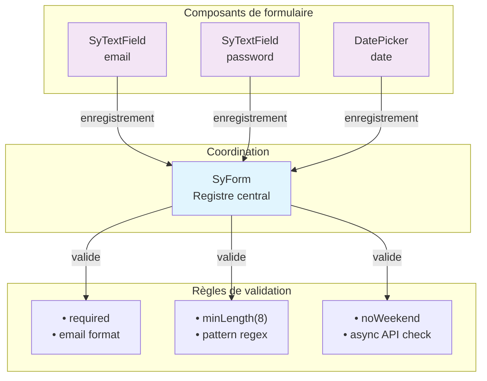
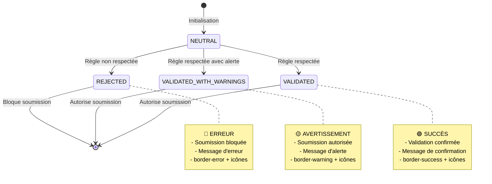
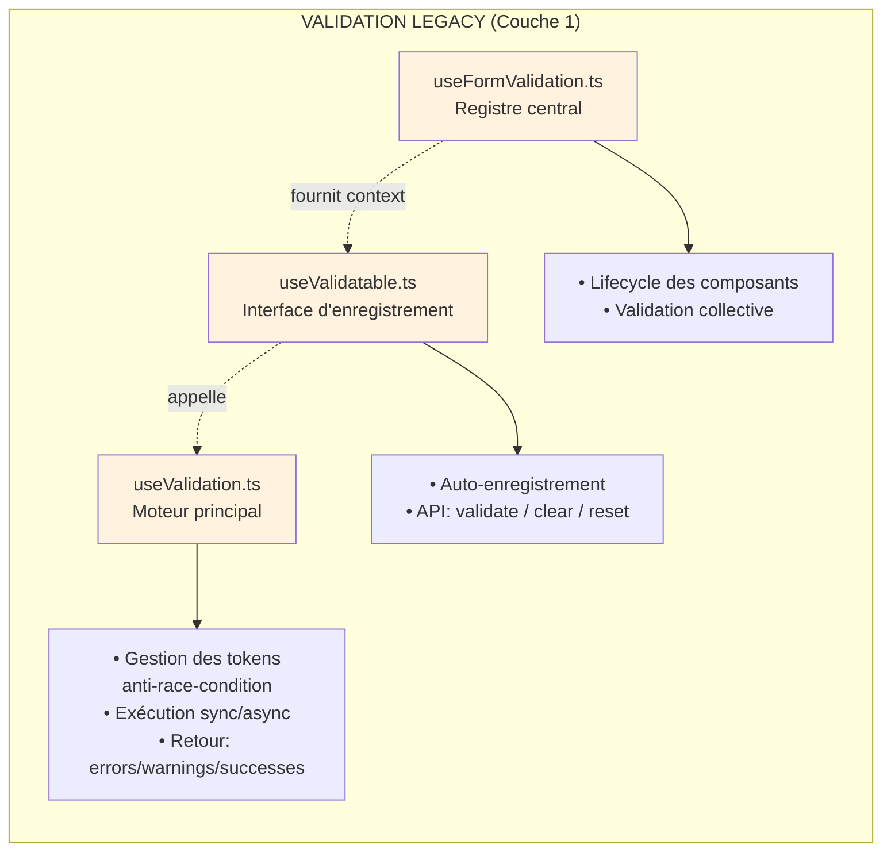
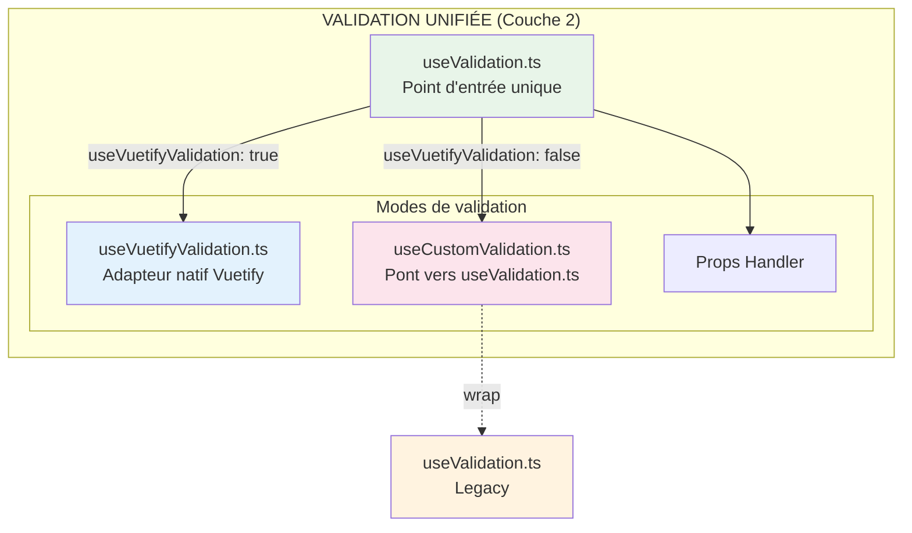
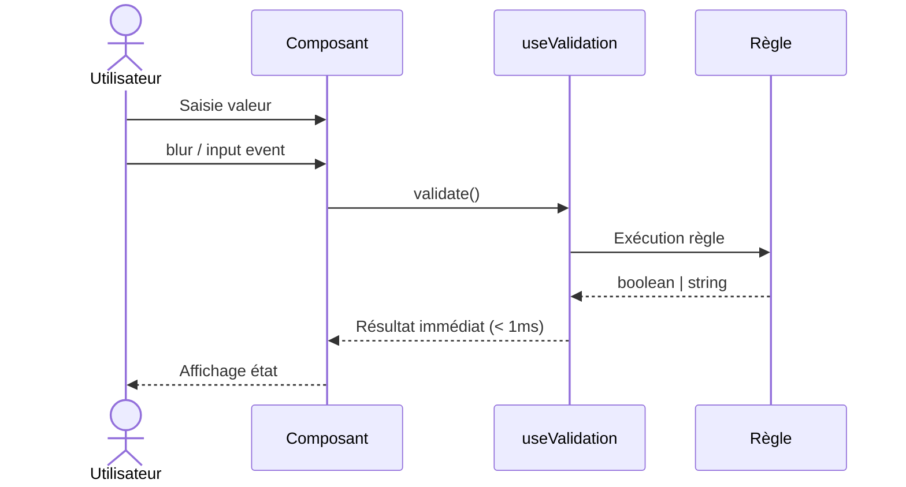
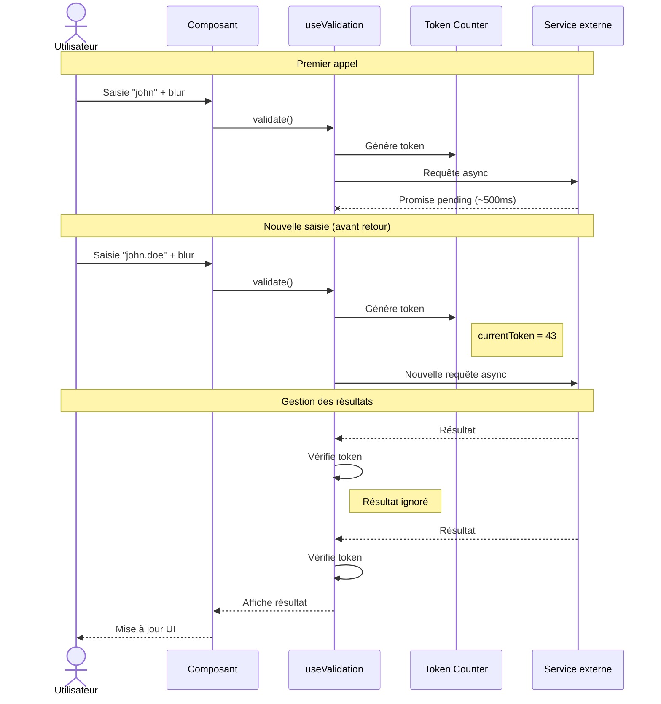
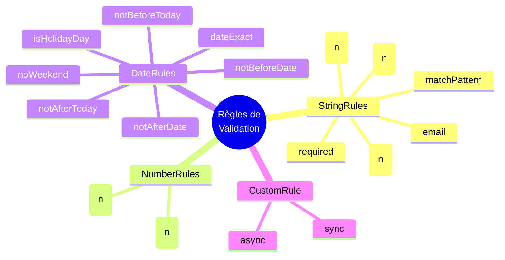
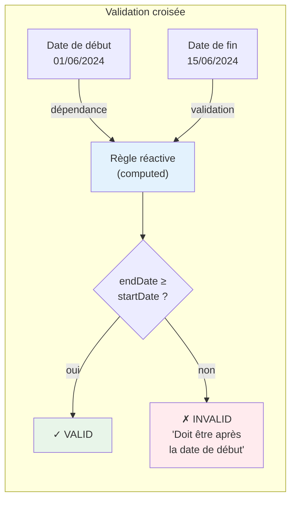
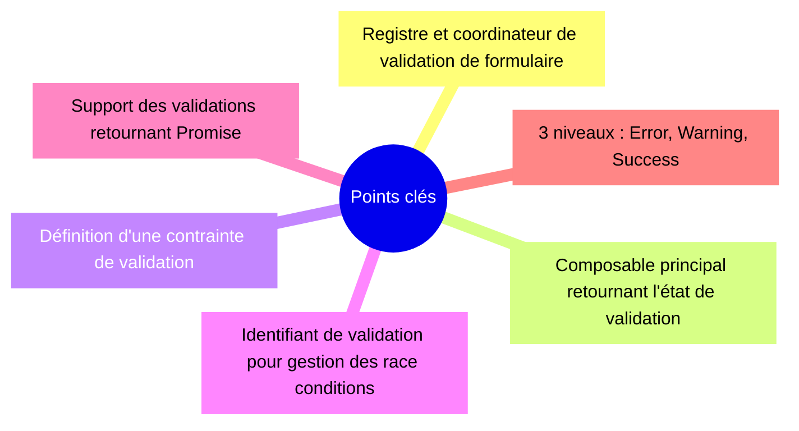

# Guide du Système de Validation

> **Vue d'ensemble** : Le système de validation fournit un **framework complet de gestion des états de formulaire**, supportant la validation synchrone et asynchrone avec gestion des conflits (race conditions), et offrant trois niveaux de feedback (erreurs bloquantes, avertissements informatifs, confirmations de succès).

---

## Vue d'ensemble



---

## Les 3 niveaux de validation



---

## Architecture à deux étages

### Couche 1 : Système Legacy (Fondations)



### Couche 2 : Système Unifié (Interface modernisée)



---

## Flux de validation

### 1. Validation Synchrone



### 2. Validation Asynchrone (Avec gestion des conflits)



**Fichiers source associés :**
- [`useValidation.ts`](src/composables/validation/useValidation.ts) - Gestion des tokens et race conditions
- [`useFieldValidation.ts`](src/composables/rules/useFieldValidation.ts) - Définition des règles custom

---

## Types de règles disponibles



**Règle personnalisée (CustomRule)**

```typescript
type CustomValidator = (value: unknown) => 
  | boolean           // true = OK, false = erreur implicite
  | string            // Message d'erreur personnalisé
  | Promise<boolean | string>  // Validation asynchrone
```

---

## Migration : Legacy → Unifié

### Avant (Legacy) - À ÉVITER

```typescript
// ❌ Ancienne façon - Directement dans le composant
import { useValidation } from '@/composables/validation/useValidation'

const { validate, errors } = useValidation({
  modelValue: ref(''),
  rules: [
    { type: 'required', options: { message: 'Requis' } },
    { type: 'email', options: {} }
  ]
})
```

### Après (Unifié) - RECOMMANDÉ

```typescript
// ✅ Nouvelle façon - Via le composant wrapper
import { useValidation } from '@/composables/unifyValidation/useValidation'

// Dans le composant (ex: SyTextField)
const { validate, errors, warnings, successes } = useValidation({
  modelValue: model,
  // Mode Vuetify ou Custom ?
  useVuetifyValidation: false, // ← false = validation Synapse
  
  // Règles personnalisées
  customRules: computed(() => [
    { type: 'required', options: { message: 'Email requis' } },
    { type: 'email', options: { message: 'Format invalide' } },
    { 
      type: 'custom', 
      options: { 
        message: 'Email déjà utilisé',
        validate: async (value) => {
          const exists = await checkEmailExists(value)
          return !exists // true = OK, false = erreur
        }
      } 
    }
  ]),
  
  // Règles d'avertissement (ne bloquent pas)
  customWarningRules: [...],
  
  // Règles de succès (feedback positif)
  customSuccessRules: [...]
})
```

---

## Checklist de migration

```
┌────────────────────────────────────────────────────────────────┐
│              CHECKLIST MIGRATION VALIDATION                     │
├────────────────────────────────────────────────────────────────┤
│                                                                 │
│  □ Importer depuis unifyValidation au lieu de validation       │
│    import { useValidation } from '@/composables/unifyValidation/useValidation'
│                                                                 │
│  □ Utiliser useVuetifyValidation pour choisir le mode          │
│    • true  → Validation Vuetify native                         │
│    • false → Validation Synapse (recommandé)                   │
│                                                                 │
│  □ Migrer les règles vers customRules                            │
│    • customRules pour les erreurs bloquantes                    │
│    • customWarningRules pour les avertissements                │
│    • customSuccessRules pour les feedbacks positifs            │
│                                                                 │
│  □ Remplacer la gestion manuelle des erreurs                     │
│    • props.errorMessages → géré automatiquement                  │
│    • hasError → utiliser le retour du composable               │
│                                                                 │
│  □ Exposer validate() pour SyForm                               │
│    defineExpose({ validateOnSubmit: validate })                │
│                                                                 │
│  □ Tester la validation asynchrone si utilisée                  │
│    • Vérifier le mécanisme de token (race condition)           │
│    • S'assurer que les promises sont gérées                   │
│                                                                 │
```

---

## Exemple complet : Formulaire avec validation croisée



**Implémentation :**

```typescript
// Champ Date de fin
const customRules = computed(() => [{
  type: 'custom',
  options: {
    validate: (endDate) => {
      const start = props.startDate
      return !start || endDate >= start || 
             'Doit être après la date de début'
    }
  }
}])

// La règle se réévalue automatiquement quand props.startDate change
```

---

## Points clés à retenir


| Concept | Explication technique | Où ça vit |
|---------|-------------------|-----------|
| SyForm | Registre et coordinateur de validation de formulaire | `components/Customs/SyForm/` |
| **useValidation** | Composable principal retournant l'état de validation | `composables/unifyValidation/` |
| **ValidationRule** | Définition d'une contrainte de validation | `useFieldValidation.ts` |
| **Token** | Identifiant de validation pour gestion des race conditions | `useValidation.ts` |
| **Async** | Support des validations retournant Promise | Règles custom avec validate async |
| **3 niveaux** | Error (REJECTED), Warning (VALIDATED_WITH_WARNINGS), Success (VALIDATED) | Retours structurés de useValidation |

---

