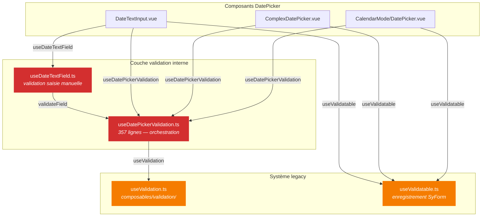
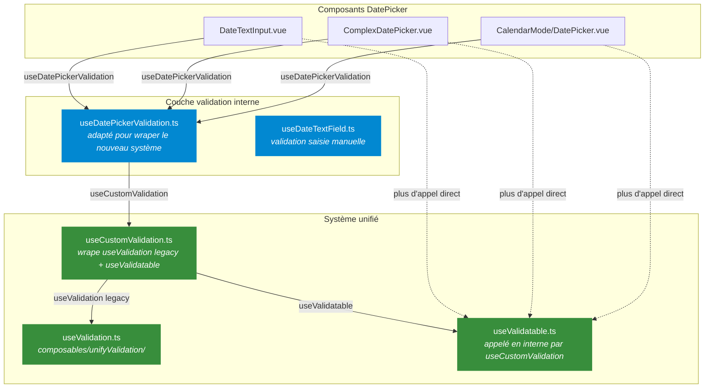

# Migration DatePicker : Validation Legacy → Unifiée

## Sommaire

1. [État des lieux](#1-état-des-lieux)
2. [Architecture actuelle (legacy)](#2-architecture-actuelle-legacy)
3. [Architecture cible (unifiée)](#3-architecture-cible-unifiée)
4. [Cartographie des fichiers impactés](#4-cartographie-des-fichiers-impactés)
5. [Plan de migration par étapes](#5-plan-de-migration-par-étapes)
6. [Risques de régression](#6-risques-de-régression)
7. [Matrice de tests de non-régression](#7-matrice-de-tests-de-non-régression)
8. [Estimation et priorisation](#8-estimation-et-priorisation)

---

## 1. État des lieux

Le DatePicker est le composant le plus complexe du design system en termes de validation. Il utilise encore exclusivement le système **legacy** (`composables/validation/useValidation.ts`) alors que d'autres composants (SyTextField, SySelect, SyAutocomplete, SyRadioGroup, NirField, SyTextArea) ont déjà été migrés vers le système **unifié** (`composables/unifyValidation/useValidation.ts`).

### Dépendances legacy dans le DatePicker

| Import legacy | Fichiers qui l'utilisent |
|---|---|
| `@/composables/validation/useValidation` | `useDatePickerValidation.ts`, `useDateTextField.ts`, `DateTextInput.vue` (types) |
| `@/composables/validation/useValidatable` | `DateTextInput.vue`, `ComplexDatePicker.vue`, `CalendarMode/DatePicker.vue` |

---

## 2. Architecture actuelle (legacy)



### Particularités de `useDatePickerValidation.ts`

Ce composable est le **cœur de la complexité**. Il ajoute une couche métier au-dessus de `useValidation` :

| Fonctionnalité | Description | Lignes |
|---|---|---|
| **Required conditionnel** | Ne déclenche l'erreur required que si : pas en validation initiale, pas de mise à jour interne, champ visible | L.117-157 |
| **Plage incomplète** | Détecte une sélection de plage en cours et suspend la validation | L.172-186 |
| **Validation de plage** | Vérifie start ≤ end + règles custom de plage (`currentRangeIsValid`) | L.196-215 |
| **CalendarMode flow** | Flow spécifique pour la date de naissance avec `isValidateOnBlur`, `onblur`, `isInitialValidation` | L.254-306 |
| **Revalidation réactive** | Watcher sur `customRules` qui revalide automatiquement via `queueMicrotask` | L.308-331 |
| **Auto-clear** | Watcher sur `selectedDates` qui clear la validation quand la date est supprimée | L.333-340 |

**Aucune de ces logiques n'existe dans le système unifié (`useCustomValidation.ts`).**

---

## 3. Architecture cible (unifiée)



### Stratégie recommandée

> **Ne pas remplacer `useDatePickerValidation.ts`**, mais **changer sa dépendance interne** : il appelle aujourd'hui `useValidation` (legacy) directement, il devra appeler le système unifié.
>
> L'enregistrement SyForm (`useValidatable`) sera alors géré par `useCustomValidation` en interne, et les appels directs à `useValidatable` dans les 3 composants devront être **supprimés** pour éviter un double enregistrement.

---

## 4. Cartographie des fichiers impactés

### Fichiers à modifier

| Fichier | Modifications | Complexité |
|---|---|---|
| `composables/useDatePickerValidation.ts` | Remplacer l'import de `useValidation` legacy par le système unifié. Conserver toute la logique métier (required conditionnel, range, CalendarMode flow). | 🔴 Élevée |
| `DateTextInput/DateTextInput.vue` | Supprimer `useValidatable` direct (L.17). Adapter le bridge validation. Supprimer l'import des types legacy (L.16). | 🟡 Moyenne |
| `ComplexDatePicker/ComplexDatePicker.vue` | Supprimer `useValidatable` direct (L.40, L.991). | 🟢 Faible |
| `CalendarMode/DatePicker.vue` | Supprimer `useValidatable` direct (L.7, L.569). | 🟢 Faible |
| `composables/useDateTextField.ts` | Adapter les imports de types (`ValidationRule`, `ValidationResult`). | 🟢 Faible |

### Fichiers non impactés (à ne pas toucher)

| Fichier | Raison |
|---|---|
| `useFieldValidation.ts` | Couche basse, indépendante du système legacy/unifié |
| `useDateRangeValidation.ts` | Pas de dépendance directe au système de validation |
| `useDateAutoClamp.ts`, `useDateInputEditing.ts`, etc. | Pas de lien avec la validation |

---

## 5. Plan de migration par étapes

### Étape 1 — Adapter `useDatePickerValidation.ts`

**Objectif** : Remplacer la dépendance `useValidation` legacy sans casser la logique métier.

```
Avant (L.2) :
  import { useValidation } from '@/composables/validation/useValidation'

Après :
  import { useValidation } from '@/composables/unifyValidation/useCustomValidation'
  // OU wraper via useValidation unifié
```

**Points d'attention** :
- Le composable utilise `useValidation({ showSuccessMessages, fieldIdentifier, disableErrorHandling })` (L.48-52). Ces options doivent rester supportées.
- Les retours `validation.displaySuccesses`, `errors`, `warnings`, `successes`, `validateField`, `clearValidation` doivent garder la même interface.
- Le `validateField` legacy accepte `(value, rules, warningRules, successRules)` — vérifier la compatibilité de la signature.

**⚠️ Risque** : Le token anti-race-condition est géré dans `useValidation` legacy. Le nouveau système hérite de ce mécanisme via `useCustomValidation` → `useValidation` legacy, donc pas de perte.

### Étape 2 — Supprimer les `useValidatable` directs

**Objectif** : Éviter le double enregistrement dans SyForm.

Supprimer dans :
- `ComplexDatePicker.vue` : L.40 (import) + L.991 (appel `useValidatable(validateOnSubmit, clearValidation, reset)`)
- `CalendarMode/DatePicker.vue` : L.7 (import) + L.569 (appel `useValidatable(validateOnSubmit, clearValidation)`)
- `DateTextInput.vue` : L.17 (import) + appel correspondant

**⚠️ Risque critique** : `useCustomValidation` appelle `useValidatable` en interne avec `modelValue`, mais le DatePicker a un **`validateOnSubmit` custom** qui fait bien plus qu'une simple validation :
- Il délègue à `dateTextInputRef.value?.validateOnSubmit()` en mode noCalendar
- Il délègue à `complexDatePickerRef.value?.validateOnSubmit()` en mode combiné
- Il gère `isInitialValidation` et `forceValidation`

→ Il faudra **probablement garder `useValidatable` en direct** dans `CalendarMode/DatePicker.vue` car la logique de `validateOnSubmit` est trop spécifique, et seulement confier au système unifié la gestion du state (errors/warnings/successes).

### Étape 3 — Adapter `DateTextInput.vue`

**Objectif** : Aligner le bridge validation avec le système unifié.

Actuellement, `DateTextInput` :
1. Crée un `bridgeValidation` via `useDatePickerValidation` (L.84-101)
2. A un `readonlyValidation` fallback (L.103-116)
3. Expose des `errors`, `warnings`, `successMessages` computed (L.118-160)
4. Appelle `useValidatable` pour s'enregistrer dans SyForm

Après migration de `useDatePickerValidation` (étape 1), le bridge fonctionnera avec le nouveau système automatiquement. Il restera à :
- Supprimer l'import de `useValidatable` et son appel
- Adapter les types importés si nécessaire

### Étape 4 — Mise à jour des types et imports dans `useDateTextField.ts`

Changements mineurs : remplacer les imports de types `ValidationRule` et `ValidationResult` pour pointer vers le nouveau module.

### Étape 5 — Tests de non-régression

Voir section [7. Matrice de tests](#7-matrice-de-tests-de-non-régression).

---

## 6. Risques de régression

### 🔴 Risque critique — Double enregistrement SyForm

| Risque | `useCustomValidation` appelle `useValidatable` en interne. Si les composants continuent aussi à appeler `useValidatable`, chaque composant sera enregistré **deux fois** dans SyForm. |
|---|---|
| **Impact** | `SyForm.validate()` appellera `validateOnSubmit` deux fois, résultats incohérents. |
| **Détection** | Test d'intégration avec SyForm : compter le nombre de composants enregistrés. |
| **Mitigation** | Supprimer les appels directs `useValidatable` ET s'assurer que `useCustomValidation` reçoit un `validateOnSubmit` équivalent, ou bien garder l'appel direct et ne pas utiliser la partie `useValidatable` de `useCustomValidation`. |

### 🔴 Risque critique — Perte de la logique CalendarMode required flow

| Risque | `validateCalendarModeDates` (L.254-306) contient un flow spécifique avec `isInitialValidation`, `isValidateOnBlur`, `onblur`, `forceValidation`. Cette logique n'a **aucun équivalent** dans `useCustomValidation`. |
|---|---|
| **Impact** | Le mode calendrier (date de naissance) pourrait afficher des erreurs required au chargement initial, ou ne plus valider au submit. |
| **Détection** | Tests `CalendarMode/tests/DatePicker.spec.ts` — scénarios required + blur. |
| **Mitigation** | Conserver `useDatePickerValidation` comme couche intermédiaire et ne migrer que sa dépendance interne (étape 1). Ne **pas** essayer de remplacer `useDatePickerValidation` par `useCustomValidation`. |

### 🟡 Risque moyen — Race conditions avec `queueMicrotask`

| Risque | `useDatePickerValidation` utilise `queueMicrotask` pour la revalidation réactive (L.315). `useCustomValidation` utilise des watchers standards. Le timing des deux pourrait entrer en conflit. |
|---|---|
| **Impact** | Validation qui s'exécute dans un ordre inattendu, messages d'erreur transitoires visibles. |
| **Détection** | Tests de régression `bridge-integration.regression.spec.ts` — changement dynamique de `customRules`. |
| **Mitigation** | Aligner les watchers : soit tout en `queueMicrotask`, soit tout en `nextTick`. |

### 🟡 Risque moyen — Perte des messages de succès custom des warning rules

| Risque | Le système legacy a un bug connu : les `successMessage` des `customWarningRules` ne sont pas collectés quand la warning rule passe. Un fix a été appliqué dans `useValidation.ts` (legacy). Si on migre vers le système unifié, il faut s'assurer que ce fix est aussi présent. |
|---|---|
| **Impact** | `successMessage: 'Date hors 2025'` d'une warning rule ne s'afficherait plus. |
| **Détection** | Test manuel avec `customWarningRules` ayant un `successMessage`. |
| **Mitigation** | Porter le fix dans le système unifié si le même bug existe, ou vérifier que `useCustomValidation` → `useValidation` legacy hérite du fix. |

### 🟡 Risque moyen — Validation de plage (displayRange)

| Risque | La validation de plage (`start ≤ end`, `currentRangeIsValid`) est codée directement dans `useDatePickerValidation.finalizeValidation` (L.193-231). Le système unifié ne gère pas les plages. |
|---|---|
| **Impact** | Plus de message "La date de fin doit être postérieure à la date de début". |
| **Détection** | Tests existants de range validation. |
| **Mitigation** | Garder `useDatePickerValidation` et sa logique `finalizeValidation` intacte. |

### 🟢 Risque faible — Compatibilité des types `ValidationRule`

| Risque | Le type `ValidationRule` dans le legacy et l'unifié est le même (réexporté). Mais `DatePickerValidationRule` est un type custom (`{ type: string, options: any }`). |
|---|---|
| **Impact** | Erreurs TypeScript à la compilation. |
| **Détection** | `pnpm type-check`. |
| **Mitigation** | Adapter les imports de types. |

### 🟢 Risque faible — Comportement `readonly` / `disabled`

| Risque | `DateTextInput` a un `readonlyValidation` fallback (L.103-116) + le bridge bascule entre readonly et normal. Le système unifié gère aussi readonly/disabled. |
|---|---|
| **Impact** | Pas de régression si on garde la couche `useDatePickerValidation`. |
| **Détection** | Tests avec `readonly: true`. |
| **Mitigation** | Ne pas toucher au `readonlyValidation` fallback dans `DateTextInput`. |

---

## 7. Matrice de tests de non-régression

### Tests existants (28 fichiers de spec)

| Fichier de test | Ce qu'il couvre | Critique pour la migration |
|---|---|---|
| `ComplexDatePicker.spec.ts` | Comportement général du mode combiné | ✅ Oui |
| `bridge-integration.regression.spec.ts` | Changement dynamique de `customRules` | ✅ Oui |
| `validation-cross.regression.spec.ts` | Validation croisée dateA → dateB, règles dynamiques, valeurs null | ✅ Oui |
| `validation-success-messages.regression.spec.ts` | Pas de double message de succès, pas de succès sans interaction | ✅ Oui |
| `DatePicker.spec.ts` (CalendarMode) | CalendarMode standard + required | ✅ Oui |
| `DateTextInput.spec.ts` | Saisie manuelle, format, required | ✅ Oui |
| `calendar-navigation.regression.spec.ts` | Navigation clavier entre mois | 🟡 Indirect |
| `exposed-methods.coverage.spec.ts` | `validateOnSubmit`, `clearValidation` exposés | ✅ Oui |
| `ComplexDatePicker.a11y.spec.ts` | Accessibilité | 🟡 Indirect |

### Tests à ajouter

| Scénario | Priorité |
|---|---|
| **SyForm + DatePicker** : un seul enregistrement, `SyForm.validate()` retourne le bon résultat | 🔴 Critique |
| **CalendarMode required + blur** : pas d'erreur au chargement, erreur au submit sans sélection | 🔴 Critique |
| **customWarningRules + successMessage** : le message custom s'affiche quand la rule passe | 🟡 Importante |
| **displayRange** : validation "fin ≥ début" toujours fonctionnelle après migration | 🟡 Importante |
| **Readonly** : aucun message d'erreur/warning/succès affiché | 🟢 Standard |

### Commande de vérification complète

```bash
# Lancer tous les tests DatePicker
pnpm vitest run src/components/DatePicker/ --reporter=verbose

# Lancer les tests de validation unifiée
pnpm vitest run src/composables/validation/tests/ --reporter=verbose
pnpm vitest run src/composables/unifyValidation/tests/ --reporter=verbose
```

---

## 8. Estimation et priorisation

| Étape | Effort | Prérequis | Risque |
|---|---|---|---|
| **1. Adapter `useDatePickerValidation.ts`** | 1-1.5 jours | Aucun | 🔴 Élevé |
| **2. Supprimer les `useValidatable` directs** | 0.5 jour | Étape 1 | 🔴 Élevé |
| **3. Adapter `DateTextInput.vue`** | 0.5 jour | Étape 1 | 🟡 Moyen |
| **4. Types dans `useDateTextField.ts`** | < 0.5 jour | Étape 1 | 🟢 Faible |
| **5. Tests de non-régression** | 0.5-1 jour | Étapes 1-4 | — |

**Total estimé : 3-4 jours**

### Ordre recommandé

1. **Écrire les tests de non-régression manquants** (SyForm integration, CalendarMode required) AVANT de commencer la migration
2. Étape 1 — Adapter `useDatePickerValidation`
3. Vérifier que tous les tests existants passent
4. Étapes 2+3+4 — Supprimer `useValidatable` directs + adapter DateTextInput + types
5. Vérifier à nouveau tous les tests
6. Test d'intégration Storybook (stories DatePicker dans tous les thèmes)

### ⚠️ Point de non-retour

La suppression de `useValidatable` direct (étape 2) est le **point de non-retour**. Avant cette étape, le code reste fonctionnel avec l'ancien système. Après, seul le nouveau système gère l'enregistrement SyForm.

> **Recommandation** : Faire une branche dédiée et merger uniquement après validation complète de la suite de tests + revue visuelle dans Storybook.
