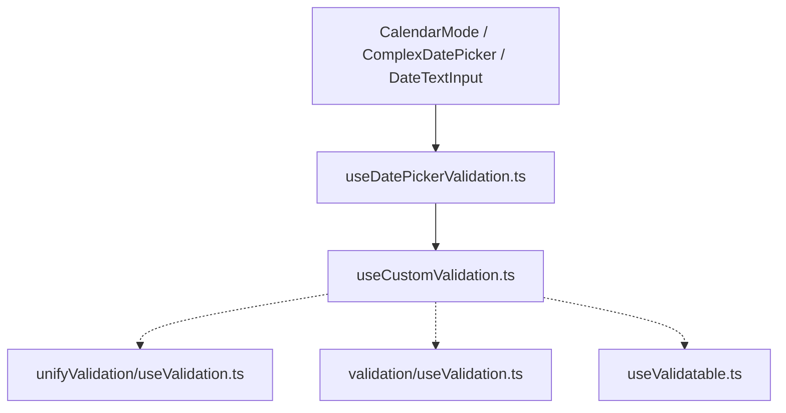

# Migration DatePicker : état actuel

La migration validation du DatePicker est terminée côté architecture cible :

- le DatePicker ne s'enregistre plus directement via `useValidatable` dans ses composants
- la validation repose sur le système unifié via `useCustomValidation`
- un bridge métier DatePicker est conservé volontairement

Le bridge concerné est :

- [`src/components/DatePicker/composables/useDatePickerValidation.ts`](src/components/DatePicker/composables/useDatePickerValidation.ts)

---

## Pourquoi garder un bridge

Supprimer totalement le bridge réintroduirait la complexité dans les composants ou dans le moteur générique.

Le bridge reste justifié car il porte encore des règles métier propres au DatePicker :

- `required` conditionnel
- validation de plage
- sélection incomplète en mode range
- flow spécifique `CalendarMode`
- orchestration `validateOnSubmit` / `SyForm`

La cible n'est donc pas “zéro bridge”, mais “bridge mince et explicite”.

---

## Architecture actuelle



---

## Frontière de responsabilité

### Ce qui appartient au bridge DatePicker

- transformer `selectedDates` en valeur validable
- ajouter les règles métier de range
- gérer le flow `CalendarMode`
- exposer un contrat simple pour les composants DatePicker

### Ce qui appartient au système unifié

- exécution des règles Synapse
- gestion sync/async
- gestion des succès, warnings et erreurs
- enregistrement `SyForm`
- support du mode Vuetify pour les composants standard

---

## Nettoyage restant

La migration fonctionnelle est faite. Le reste relève du nettoyage de fin de migration :

- maintenir le bridge mince
- éviter de recréer des états de validation parallèles
- garder la documentation alignée avec l'architecture réelle

---

## Vérifications minimales

```bash
pnpm vitest run --coverage.enabled false src/components/DatePicker/composables/tests/useDatePickerValidation.spec.ts src/components/DatePicker/DateTextInput/tests/DateTextInput.spec.ts src/components/DatePicker/ComplexDatePicker/tests/ComplexDatePicker.spec.ts src/components/DatePicker/CalendarMode/tests/DatePicker.spec.ts
pnpm vue-tsc -p tsconfig.app.json --noEmit
pnpm build
```
