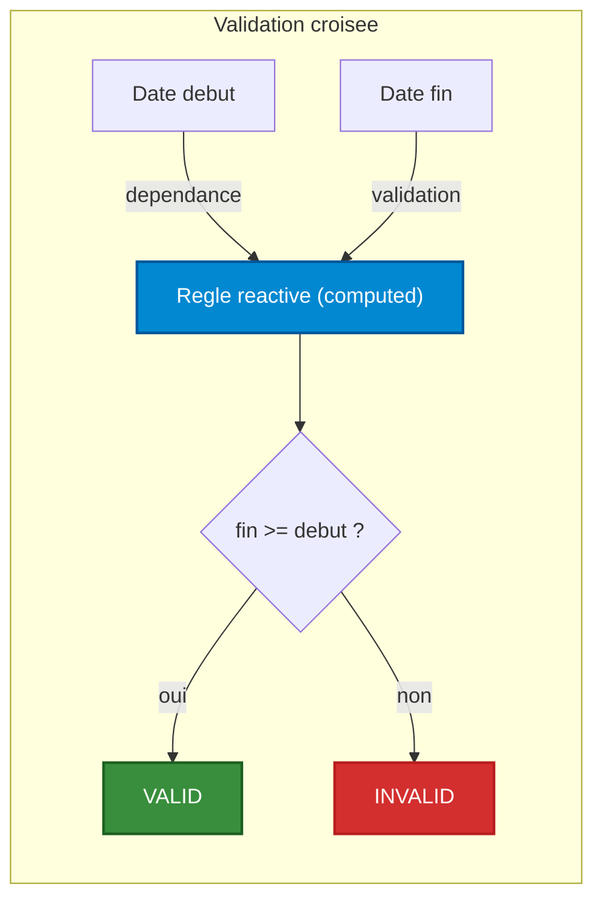

## Migration : Legacy → Unifié

### Avant (Legacy) - À ÉVITER

```typescript
// ❌ Ancienne façon - Directement dans le composant
import { useValidation } from '@/composables/validation/useValidation'

const { validate, errors } = useValidation({
  modelValue: ref(''),
  rules: [
    { type: 'required', options: { message: 'ce champs est requis' } },
    { type: 'email', options: {message: 'L\'adresse email est invalid. (exemple: leon@prunelle@redaction.fr)'} }
  ]
})
```

### Après (Unifié) - RECOMMANDÉ

```typescript
// ✅ Nouvelle façon - Via le composant wrapper
import { useValidation } from '@/composables/unifyValidation/useValidation'

// Dans le composant ou un composable dédié (ex: SyTextField)
// Les valeurs passés doivent êtres réactives
const { validate, errors, warnings, successes } = useValidation({
    modelValue, // la valeur du champs
    readonly, // Si le champs est en mode readonly
    disabled, // Si le champs est désactivé
    required, // Si le champs est requis
    isValidateOnBlur, // si la validation doit se déclencher au blur ou à chaque changement
    showSuccessMessage, // Affiche les messages de succès (feedback positif)
    disableErrorHandling, // Désactive la validation
    label, // Label du champ (utilisé dans les messages d'erreur par défaut)
    focused, // Si le champ est actuellement focus
    errorMessages, // Messages d'erreur forcés
    warningMessages, // Messages de warning forcés
    successMessages, // Messages de succès forcés
    hasErrorProp, // Force l'état d'erreur
    hasWarningProp, // Force l'état d'avertissement
    hasSuccessProp, // Force l'état de succès
    useVuetifyValidation, // Si true, utilise le mode de validation Vuetify (sinon Synapse)
    rules // Règles de validation synchrones au format Vuetify (mode Vuetify uniquement)
    customRules, // Règles de validation personnalisées (erreurs bloquantes)
    customWarningRules, // Règles d’avertissement (non bloquantes)
    customSuccessRules // Règles de succès (feedback positif)
    maxErrors, // Nombre maximum d'erreurs à afficher
}),
```

### Exemple de défunition de règles personnalisées

```typescript
const customRules = computed(() => [
  {
    type: 'minLength',
    options: {
        length: 8,
        message: 'Doit contenir au moins 8 caractères'
    }
  },
{
    type: 'custom',
    options: {
        validate: (value) => /[A-Z]/.test(value),
        message: 'Doit contenir au moins une majuscule'
    }
}])
```


## Checklist de migration
                   
                                                           
### □ Importer depuis `unifyValidation` au lieu de validation       
``` typescript
  	import { useValidation, validationPropsDefaults, type FieldValidationProps } from '@/composables/unifyValidation/useValidation'
```

### □ Definir les props de validation du composant
```typescript
const props = withDefaults(
    defineProps<{
    ...FieldValidationProps,
            // autres props spécifiques au composant
        }>(),
        {
            ...validationPropsDefaults,
            // autres valeurs par défaut spécifiques au composant
        }
    )
```
### □ Appeler le composable `useValidation` en faisant passer en tant que ref les props nécessaires.
```typescript
	const { validate, errors, warnings, successes, hasError, hasWarning, hasSuccess } = useValidation({
        ... // params sous forme de ref
    })
```
### □ Supprimer les anciennes variables d'états lié a la validation (ex: `errorMessages` `isValid`, etc) et utiliser les nouvelles variables retournés par `useValidation` pour gérer l'affichage des messages et l'état de validation du champ.  


## Exemple complet : Formulaire avec validation croisée



**Implémentation :**

```typescript
// Champ Date de fin
const customRules = computed(() => [{
  type: 'custom',
  options: {
    validate: (endDate) => {
      const start = props.startDate
      return !start || endDate >= start
    },
    message: 'La date de fin doit être supérieure ou égale à la date de début'
  }
}])

// La règle se réévalue automatiquement quand props.startDate change
```
