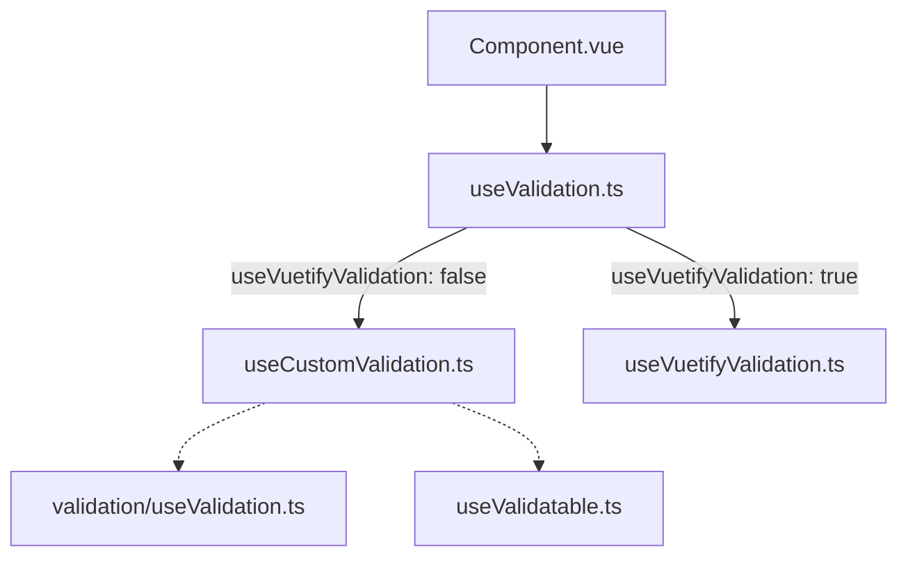

# Vue d'ensemble du système de validation

Le design system expose un point d'entrée de validation unifié pour les composants de champ, avec deux modes de fonctionnement :

- mode Synapse via [`src/composables/unifyValidation/useValidation.ts`](src/composables/unifyValidation/useValidation.ts)
- mode Vuetify via [`src/composables/unifyValidation/useVuetifyValidation.ts`](src/composables/unifyValidation/useVuetifyValidation.ts)

Le moteur legacy existe encore en profondeur, mais il ne doit plus être utilisé comme point d'entrée direct dans les composants migrés.

---

## Props principales

| Prop | Type | Description |
|---|---|---|
| `modelValue` | `unknown` | Valeur du champ à valider |
| `customRules` | `ValidationRule[]` | Règles d'erreur bloquantes |
| `customWarningRules` | `ValidationRule[]` | Règles d'avertissement |
| `customSuccessRules` | `ValidationRule[]` | Règles de succès |
| `useVuetifyValidation` | `boolean` | Bascule vers le mode Vuetify |
| `rules` | `VuetifyValidationRule[]` | Règles Vuetify synchrones |
| `errorMessages` | `string[]` | Messages d'erreur injectés |
| `warningMessages` | `string[]` | Messages de warning injectés |
| `successMessages` | `string[]` | Messages de succès injectés |

---

## Architecture cible

### Règle simple

- un composant standard appelle directement `useValidation`
- un composant avec logique métier forte peut conserver un composable intermédiaire
- ce composable intermédiaire ne doit porter que la logique métier qui n'appartient pas au moteur générique

---

## Cas particulier DatePicker

Le DatePicker est migré sur le système unifié, mais il conserve un bridge métier dédié :

- [`src/components/DatePicker/composables/useDatePickerValidation.ts`](src/components/DatePicker/composables/useDatePickerValidation.ts)

Ce bridge est volontairement conservé car il porte encore des règles métier qui ne doivent pas être poussées dans le moteur générique :

- `required` conditionnel
- validation de plage
- sélection incomplète en mode range
- flow spécifique `CalendarMode`
- orchestration `validateOnSubmit` pour `SyForm`

La cible n'est donc pas la suppression pure du bridge, mais son maintien sous une forme mince, explicite et stable.

---

## Fichiers de référence

- [`src/composables/unifyValidation/useValidation.ts`](src/composables/unifyValidation/useValidation.ts) : point d'entrée recommandé
- [`src/composables/unifyValidation/useCustomValidation.ts`](src/composables/unifyValidation/useCustomValidation.ts) : mode Synapse unifié
- [`src/composables/unifyValidation/useVuetifyValidation.ts`](src/composables/unifyValidation/useVuetifyValidation.ts) : mode Vuetify
- [`src/components/DatePicker/composables/useDatePickerValidation.ts`](src/components/DatePicker/composables/useDatePickerValidation.ts) : bridge métier DatePicker
- [`src/components/Customs/SyForm/SyForm.vue`](src/components/Customs/SyForm/SyForm.vue) : coordination formulaire

---

## À retenir

- importer depuis `unifyValidation` pour tout nouveau composant migré
- ne pas utiliser `validation/useValidation.ts` directement dans un composant public migré
- ne créer un bridge métier que si le domaine a de vraies règles transverses que le moteur générique ne doit pas absorber
