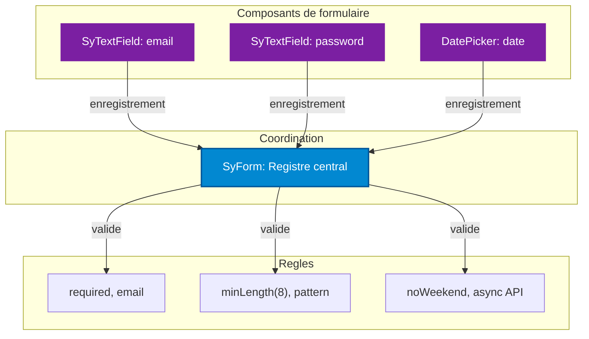
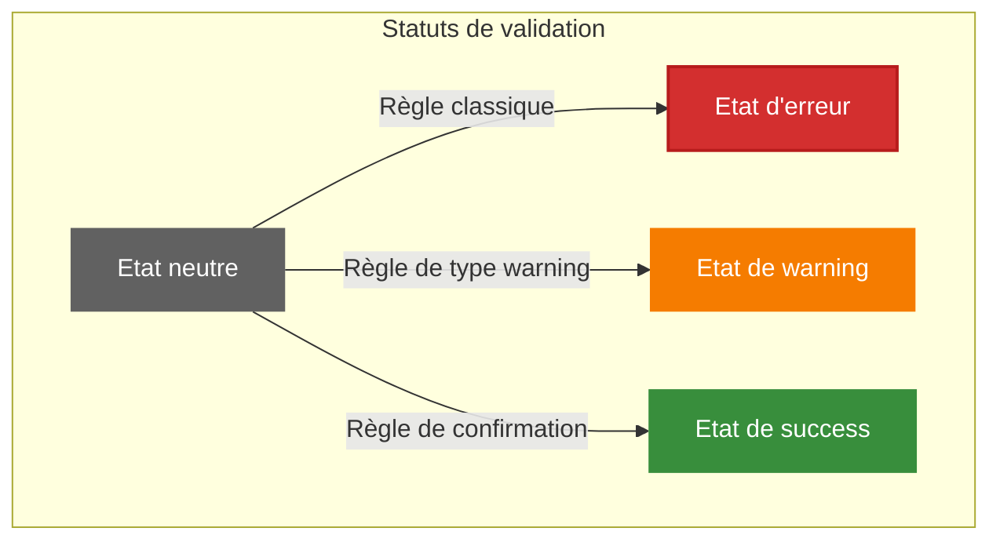
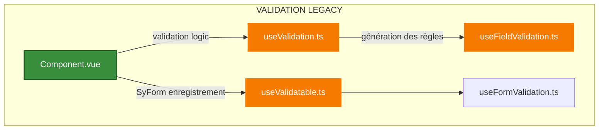
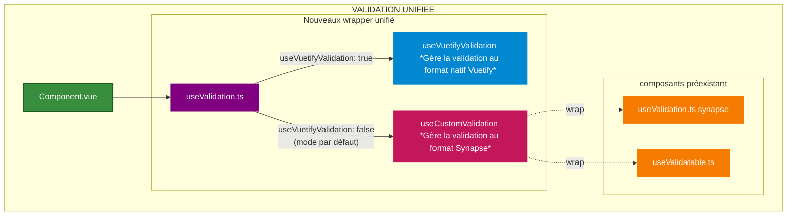
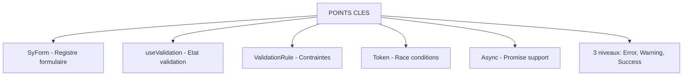

# Vue d'ensemble du système de validation

## Props principales

| Prop                  | Type      | Description                                                                 |
|-----------------------|-----------|-----------------------------------------------------------------------------|
| `modelValue`          | any       | Valeur du champ à valider.                                                  |
| `customRules`         | array     | Tableau de règles de validation personnalisées (erreurs bloquantes).        |
| `customWarningRules`  | array     | Tableau de règles d’avertissement (non bloquantes).                         |
| `customSuccessRules`  | array     | Tableau de règles de succès (feedback positif).                             |
| `useVuetifyValidation`| boolean   | Active le mode validation Vuetify (sinon Synapse).                          |
| `rules`        | array     | Règles synchrones au format Vuetify (mode Vuetify uniquement).              |

> **Vue d'ensemble** : Le système de validation fournit un **framework complet de gestion des états de formulaire**, supportant la validation synchrone et asynchrone avec gestion des conflits (race conditions), et offrant trois niveaux de feedback (erreurs bloquantes, avertissements informatifs, confirmations de succès).

---

## Vue d'ensemble

**Fichiers source :**
- [`SyForm.vue`](src/components/Customs/SyForm/SyForm.vue) - Composant formulaire
- [`SyTextField.vue`](src/components/Customs/SyTextField/SyTextField.vue) - Champ de saisie
- [`DateTextInput.vue`](src/components/DatePicker/DateTextInput/DateTextInput.vue) - Saisie de date
- [`useFieldValidation.ts`](src/composables/rules/useFieldValidation.ts) - Définition des règles

---

## Les 3 niveaux de validation

**Légende :**
- 🔴 **REJECTED (Erreur)** : Soumission bloquée, border-error + icone
- 🟡 **VALIDATED_WITH_WARNINGS (Avertissement)** : Soumission autorisée, border-warning  + icone
- 🟢 **VALIDATED (Succès)** : Validation confirmée, border-success + icone

---

## Architecture à deux étages

### Couche 1 : Système Legacy (Fondations)

### Couche 2 : Système Unifié (Interface modernisée)

Le nouveau système permet :
- D'avoir un seul point d'entré pour la validation et l'enregistrement dans le registre de formulaire (SyForm).
 - ajoute une couche d'abstraction pour gérer les différents êtats de validation (error, warning, success)
- Gérer les règles de validation au format natif Vuetify ou au format Synapse

---

## Points clés à retenir

| Concept | Explication technique | Où ça vit |
|---------|-------------------|-----------|
| SyForm | Registre et coordinateur de validation de formulaire | `components/Customs/SyForm/` |
| **useValidation** | Composable principal retournant l'état de validation | `composables/unifyValidation/useValidation.ts` |
| **ValidationRule** | Définition d'une contrainte de validation | `composable/rules/useFieldValidation.ts` |
| **Token** | Identifiant pour éviter les validations concurrentes (race conditions) | `composable/validation/useValidation.ts` |
| **Async** | Support des validations retournant Promise | Règles custom avec validate async |
| **3 niveaux** | Erreur bloquante, avertissement informatif, confirmation de succès | `composable/validation/useValidation.ts`|
