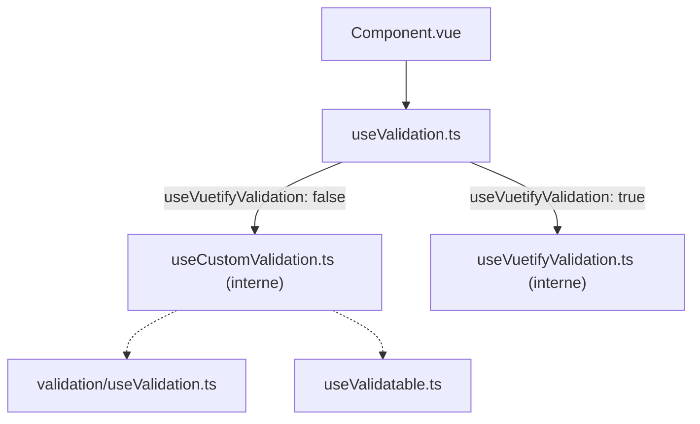

# Vue d'ensemble du système de validation

Le design system expose **un seul point d'entrée** pour la validation des composants de champ :

- [`src/composables/unifyValidation/useValidation.ts`](src/composables/unifyValidation/useValidation.ts)

`useValidation` sélectionne en interne le mode Synapse ou Vuetify, expose un état commun et
enregistre automatiquement le champ auprès du `SyForm` parent. Les autres composables de
validation sont des détails d'implémentation et ne doivent pas être appelés directement par
un composant.

---

## Props principales

| Prop | Type | Description |
|---|---|---|
| `modelValue` | `unknown` | Valeur du champ à valider |
| `customRules` | `ValidationRule[]` | Règles d'erreur bloquantes |
| `customWarningRules` | `ValidationRule[]` | Règles d'avertissement |
| `customSuccessRules` | `ValidationRule[]` | Règles de succès |
| `useVuetifyValidation` | `boolean` | Bascule vers le mode Vuetify |
| `rules` | `VuetifyValidationRule[]` | Règles Vuetify synchrones |
| `errorMessages` | `string[]` | Messages d'erreur injectés |
| `warningMessages` | `string[]` | Messages de warning injectés |
| `successMessages` | `string[]` | Messages de succès injectés |

---

## Architecture cible

```mermaid
flowchart TB
    Entry["Component.vue"]
    Unified["useValidation.ts"]
    Custom["useCustomValidation.ts (interne)"]
    Vuetify["useVuetifyValidation.ts (interne)"]
    Legacy["validation/useValidation.ts"]
    Validatable["useValidatable.ts"]

    Entry --> Unified
    Unified -->|useVuetifyValidation: false| Custom
    Unified -->|useVuetifyValidation: true| Vuetify
    Custom -.-> Legacy
    Custom -.-> Validatable
```

### Règle simple

- un composant appelle toujours `useValidation`
- `useValidation` gère la validation, l'état affiché et l'enregistrement auprès de `SyForm`
- un bridge métier peut préparer les données et les règles, mais délègue ces responsabilités à `useValidation`
- ne pas appeler directement `useCustomValidation`, `useVuetifyValidation` ou `useValidatable`

### Enregistrement auprès de SyForm

L'appel à `useValidation` suffit pour rendre le champ compatible avec un `SyForm` parent.
Il ne faut pas ajouter un second appel à `useValidatable`, sous peine d'enregistrer le champ
deux fois. L'option `{ registerWithForm: false }` est réservée aux composants composites dont
un autre champ porte volontairement l'enregistrement.

---

## Cas particulier DatePicker

Le DatePicker est migré sur le système unifié, mais il conserve un bridge métier dédié :

- [`src/components/DatePicker/composables/useDatePickerValidation.ts`](src/components/DatePicker/composables/useDatePickerValidation.ts)

Ce bridge est volontairement conservé car il porte encore des règles métier qui ne doivent pas être poussées dans le moteur générique :

- `required` conditionnel
- validation de plage
- sélection incomplète en mode range
- flow spécifique `CalendarMode`
- orchestration `validateOnSubmit` pour `SyForm`

La cible n'est donc pas la suppression pure du bridge, mais son maintien sous une forme mince, explicite et stable.
Le bridge DatePicker appelle encore directement une couche interne pour ses besoins
d'orchestration spécifiques. Cette exception transitoire ne constitue pas un second point
d'entrée et ne doit pas être reproduite dans un nouveau composant.

---

## Validité globale dans SyForm

`SyForm` agrège le statut du `VForm` Vuetify et celui des composants Synapse enregistrés.
Les champs Synapse réactifs sont évalués silencieusement au montage : leurs règles
alimentent le `v-model` du formulaire sans afficher prématurément les messages de validation.

Le `v-model` de `SyForm` vaut :

- `true` lorsque toutes les règles évaluées passent ;
- `false` dès qu'au moins un champ Vuetify ou Synapse est invalide ;
- `null` lorsqu'aucun statut de champ n'est disponible.

Ce comportement permet notamment de désactiver un bouton de soumission tant que le
formulaire n'est pas valide avec `:disabled="formValid !== true"`.

---

## Fichiers de référence

- [`src/composables/unifyValidation/useValidation.ts`](src/composables/unifyValidation/useValidation.ts) : unique point d'entrée
- [`src/composables/unifyValidation/useCustomValidation.ts`](src/composables/unifyValidation/useCustomValidation.ts) : implémentation interne du mode Synapse
- [`src/composables/unifyValidation/useVuetifyValidation.ts`](src/composables/unifyValidation/useVuetifyValidation.ts) : implémentation interne du mode Vuetify
- [`src/components/DatePicker/composables/useDatePickerValidation.ts`](src/components/DatePicker/composables/useDatePickerValidation.ts) : bridge métier DatePicker
- [`src/components/Customs/SyForm/SyForm.vue`](src/components/Customs/SyForm/SyForm.vue) : coordination formulaire

---

## À retenir

- importer uniquement `unifyValidation/useValidation` pour tout nouveau composant migré
- ne pas appeler directement les moteurs internes ni `useValidatable`
- laisser `useValidation` gérer l'enregistrement auprès de `SyForm`
- ne créer un bridge métier que si le domaine a de vraies règles transverses que le moteur générique ne doit pas absorber
