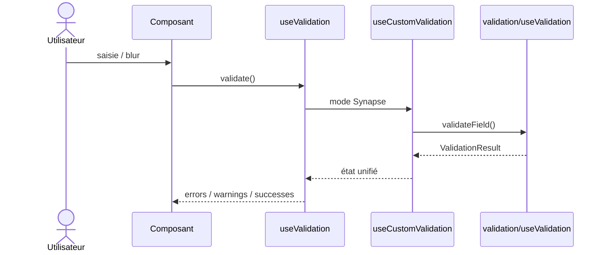

# Validation Synapse

Le mode Synapse correspond au mode de validation applicatif du design system :

- erreurs bloquantes
- warnings non bloquants
- succès
- support sync/async
- gestion des race conditions

Pour un composant migré, le point d'entrée recommandé n'est plus le moteur legacy direct, mais :

- [`src/composables/unifyValidation/useValidation.ts`](src/composables/unifyValidation/useValidation.ts)
- ou [`src/composables/unifyValidation/useCustomValidation.ts`](src/composables/unifyValidation/useCustomValidation.ts) pour une couche intermédiaire interne

Le moteur legacy [`src/composables/validation/useValidation.ts`](src/composables/validation/useValidation.ts) reste utilisé en profondeur par le système unifié, mais ne constitue plus l'API d'intégration cible.

---

## Props spécifiques Synapse

| Prop | Type | Description |
|---|---|---|
| `customRules` | `ValidationRule[]` | Règles d'erreur bloquantes |
| `customWarningRules` | `ValidationRule[]` | Règles d'avertissement |
| `customSuccessRules` | `ValidationRule[]` | Règles de succès |
| `isValidateOnBlur` | `boolean` | Déclenchement au blur ou à la saisie |
| `showSuccessMessages` | `boolean` | Affichage des messages de succès |

---

## Flux

---

## Cas DatePicker

Le DatePicker utilise bien le mode Synapse, mais au travers d'un bridge métier :

- [`src/components/DatePicker/composables/useDatePickerValidation.ts`](src/components/DatePicker/composables/useDatePickerValidation.ts)

Ce bridge wrappe `useCustomValidation` et ajoute uniquement les règles métier DatePicker :

- required conditionnel
- validation de plage
- flow `CalendarMode`
- orchestration `SyForm`

Ce pattern est acceptable tant que la couche intermédiaire reste dédiée au métier et n'absorbe pas la gestion générique des états de validation.

---

## Fichiers de référence

- [`src/composables/unifyValidation/useValidation.ts`](src/composables/unifyValidation/useValidation.ts)
- [`src/composables/unifyValidation/useCustomValidation.ts`](src/composables/unifyValidation/useCustomValidation.ts)
- [`src/composables/validation/useValidation.ts`](src/composables/validation/useValidation.ts)
- [`src/composables/rules/useFieldValidation.ts`](src/composables/rules/useFieldValidation.ts)
