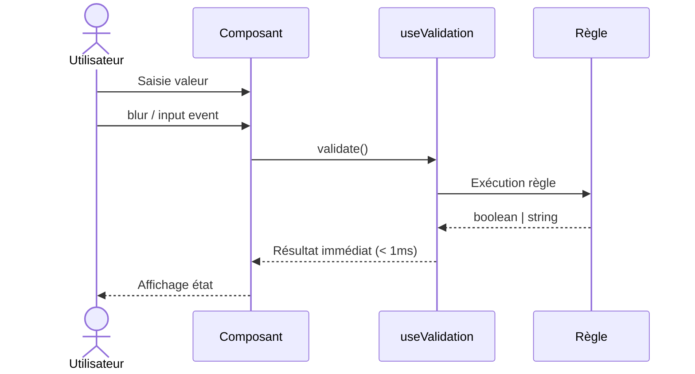
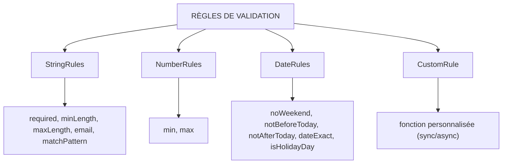

# Fonctionnalité et fonctionnement de la validation Synapse

Le system de validation propre au design sytème synapse permet d'exécuter une validation sur les champs de formulaires, ces règles de validations peuvent être de trois états : `error`, `warning` ou `success`.
Le système comporte de nombreuses règles intégrées pour valider des nombres, des chaines de caractères ou bien des dates.
Ce system de validation n'est pas compatibles avec le composant `VForm` de Vuetify, il est necessaire d'utiliser le composant `SyForm` de Synapse.


## Props spécifiques Synapse

| Prop                  | Type      | Description                                                                 |
|-----------------------|-----------|-----------------------------------------------------------------------------|
| `customRules`         | array     | Règles de validation personnalisées (erreurs bloquantes).                   |
| `customWarningRules`  | array     | Règles d’avertissement (non bloquantes).                                    |
| `customSuccessRules`  | array     | Règles de succès (feedback positif).                                        |


## Flux de validation

### 1. Validation Synchrone



### 2. Validation Asynchrone (Avec gestion des conflits)

Si une nouvelle validation est déclanché et que la validation précedente n'a pas eu le temps de s'exécuter complètement, un systeme de token permet de mettre fin à la validation précédente pour ne prendre que la dernière valeur en compte pour valider le champs

```mermaid
sequenceDiagram
    actor U as Utilisateur
    participant C as Composant
    participant V as useValidation
    participant R as Règle
    participant API as Service externe

    Note over U,API: Premier appel
    U->>C: Saisie "john" + blur
    C->>V: validate()
    Note right of V: La validation est déclenché
    V->>V: Génère token #35;42
    V->>R: Exécution de la règle
    R->>API: Requête HTTP
    R-->>V: Retourne une promesse
    note over API: Pending (~500ms)

    Note over U,API: Nouvelle saisie (avant retour)
    U->>C: Saisie "john.doe" + blur
    C->>V: validate()
    Note right of V: La validation est déclenché
    V->>V: Génère token &#35;43
    Note right of V: currentToken = #35;43<br/>#35;42 devient obsolète
    V->>R: Exécution de la règle
    R->>API: Requête HTTP
    R-->>V: Retourne une promesse
    note over API: Pending (~500ms)

    Note over U,API: Gestion des résultats
    API-->>R: Résultat de la requête
    R->>R: Exécution de la règle avec le résultat
    R-->>V: Résolution de la promesse<br/>(validation token #35;42)
    V->>V: Vérifie token #35;42 != #35;43
    Note right of V: Résultat ignoré

    API-->>R: Résultat de la requête
    R->>R: Exécution de la règle avec le résultat
    R-->>V: Résolution de la promesse<br>(validation token #35;43)
    V->>V: Vérifie token #35;43 == #35;43
    Note right of V: Résultat pris en compte
    V-->>C: Met à jour les variables d'état
    C-->>U: Mise à jour UI
```




**Fichiers source associés :**
- [`useValidation.ts`](src/composables/validation/useValidation.ts) - Gestion des tokens et validations concurrentes (race conditions)
- [`useFieldValidation.ts`](src/composables/rules/useFieldValidation.ts) - Définition des règles custom

---

## Types de règles disponibles



**Règle personnalisée (CustomRule)**

```typescript
type CustomValidator = {
  type: 'custom',
  options: {
    validate: (value: unknown): boolean | Promise<boolean>
    message: string // Le message d'erreur à afficher
  }
}
```

---
