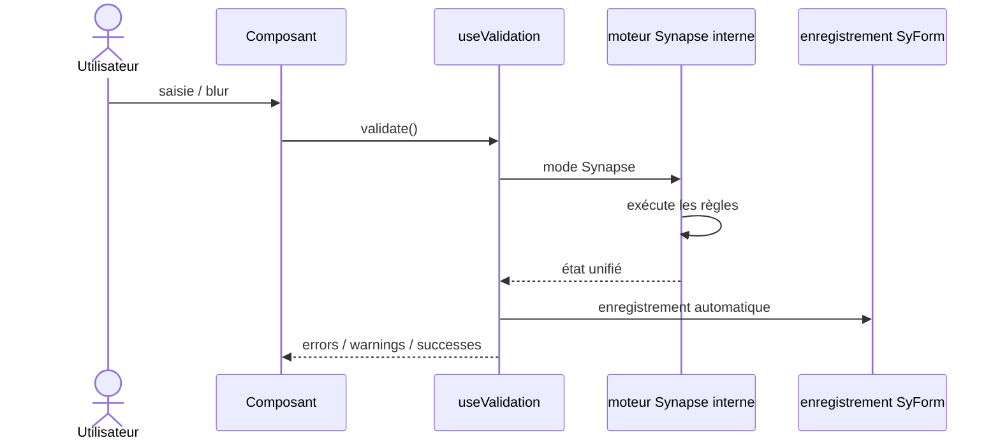

# Validation Synapse

Le mode Synapse correspond au mode de validation applicatif du design system :

- erreurs bloquantes
- warnings non bloquants
- succès
- support sync/async
- gestion des race conditions

Pour un composant migré, l'unique point d'entrée est :

- [`src/composables/unifyValidation/useValidation.ts`](src/composables/unifyValidation/useValidation.ts)

Il exécute les règles Synapse, expose les états de validation et enregistre automatiquement
le champ auprès de `SyForm`. `useCustomValidation`, le moteur legacy et `useValidatable`
restent utilisés en interne, mais ne constituent plus des API d'intégration.

---

## Props spécifiques Synapse

| Prop | Type | Description |
|---|---|---|
| `customRules` | `ValidationRule[]` | Règles d'erreur bloquantes |
| `customWarningRules` | `ValidationRule[]` | Règles d'avertissement |
| `customSuccessRules` | `ValidationRule[]` | Règles de succès |
| `isValidateOnBlur` | `boolean` | Déclenchement au blur ou à la saisie |
| `showSuccessMessages` | `boolean` | Affichage des messages de succès |

---

## Flux

```mermaid
sequenceDiagram
    actor U as Utilisateur
    participant C as Composant
    participant UV as useValidation
    participant CV as moteur Synapse interne
    participant F as enregistrement SyForm

    U->>C: saisie / blur
    C->>UV: validate()
    UV->>CV: mode Synapse
    CV->>CV: exécute les règles
    CV-->>UV: état unifié
    UV->>F: enregistrement automatique
    UV-->>C: errors / warnings / successes
```

---

## Cas DatePicker

Le DatePicker utilise bien le mode Synapse, mais au travers d'un bridge métier :

- [`src/components/DatePicker/composables/useDatePickerValidation.ts`](src/components/DatePicker/composables/useDatePickerValidation.ts)

Ce bridge prépare les données et règles métier. Il appelle encore directement une couche
interne pour son orchestration historique ; cette exception transitoire ne doit pas servir
de modèle à un nouveau composant :

- required conditionnel
- validation de plage
- flow `CalendarMode`
- orchestration `SyForm`

Ce pattern est acceptable tant que la couche intermédiaire reste dédiée au métier et n'absorbe pas la gestion générique des états de validation.

---

## Fichiers de référence

- [`src/composables/unifyValidation/useValidation.ts`](src/composables/unifyValidation/useValidation.ts)
- [`src/composables/rules/useFieldValidation.ts`](src/composables/rules/useFieldValidation.ts)
