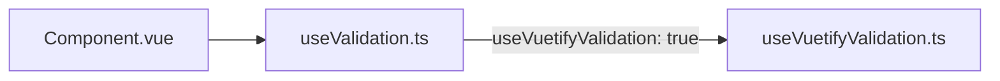

# Validation compatible Vuetify

Le système unifié permet aussi d'utiliser le mode de validation natif Vuetify.

L'unique point d'entrée reste :

- [`src/composables/unifyValidation/useValidation.ts`](src/composables/unifyValidation/useValidation.ts)

avec `useVuetifyValidation: true`.

Le composant ne doit pas appeler directement le composable interne
`useVuetifyValidation`. Le point d'entrée unifié sélectionne ce moteur, normalise son état
et assure l'enregistrement auprès de `SyForm`.

---

## Props spécifiques

| Prop | Type | Description |
|---|---|---|
| `useVuetifyValidation` | `boolean` | Active le mode Vuetify |
| `rules` | `VuetifyValidationRule[]` | Règles synchrones Vuetify |

---

## Fonctionnement



Le mode Vuetify est utile quand le composant doit s'aligner sur des règles simples au format natif Vuetify.

Le mode Synapse reste préférable si le composant doit exposer :

- erreurs
- warnings
- succès
- règles async
- messages injectés et états forcés

---

## Exemple

```ts
import { useValidation } from '@/composables/unifyValidation/useValidation'

const { validate, errors } = useValidation({
	modelValue,
	readonly,
	disabled,
	required,
	isValidateOnBlur,
	showSuccessMessages,
	disableErrorHandling,
	label,
	focused,
	useVuetifyValidation: true,
	rules: computed(() => [
		(v) => !!v || 'Champ requis',
		(v) => /.+@.+\\..+/.test(v) || 'Email invalide',
	]),
})
```

---

## `required` en mode Vuetify

Comme dans Vuetify, la prop `required` **ne valide rien** en mode Vuetify : elle n'ajoute que
l'indication visuelle (astérisque) et la sémantique ARIA (`aria-required`). Un champ requis vide ne
bloque donc pas la soumission de `SyForm` sans règle explicite :

```vue
<SyTextField
	v-model="email"
	label="E-mail"
	required
	use-vuetify-validation
	:rules="[v => !!v || 'Champ requis']"
/>
```

Les règles intégrées des composants (`customRules`, règle « requis » par défaut, formats propres à
`PhoneField`, `NirField`…) relèvent du mode Synapse et ne s'appliquent pas non plus en mode Vuetify.

En développement, `useValidation` émet un avertissement console quand un champ est `required` en
mode Vuetify sans aucune règle Vuetify.

---

## Cas DatePicker

Le DatePicker supporte désormais aussi `useVuetifyValidation` + `rules`.

Il conserve néanmoins un bridge métier dédié :

- [`src/components/DatePicker/composables/useDatePickerValidation.ts`](src/components/DatePicker/composables/useDatePickerValidation.ts)

Ce bridge porte encore des règles métier qui dépassent le simple contrat Vuetify :

- plage de dates
- `required` conditionnel
- flow `CalendarMode`
- soumission `SyForm`

Le mode Vuetify est donc possible sur DatePicker pour s'aligner avec les autres champs migrés, mais le mode Synapse reste le plus adapté dès qu'une règle dépend du métier date.
